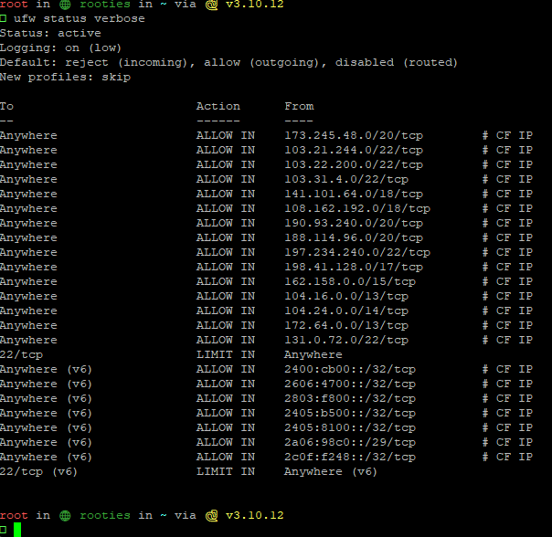

# CloudflareIPTables

Configures your firewall to only accept incoming connections from Cloudflare's reverse proxy IP ranges.


#### Requirements

- ``python``
- ``httpx``
- ``numpy``

Installation:

```
git clone https://github.com/Z3NTL3/CloudflareIPTables
cd CloudflareIPTables
pip3 install -r requirements.txt
```